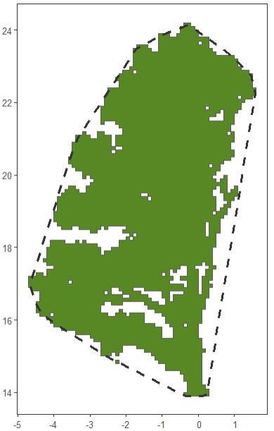
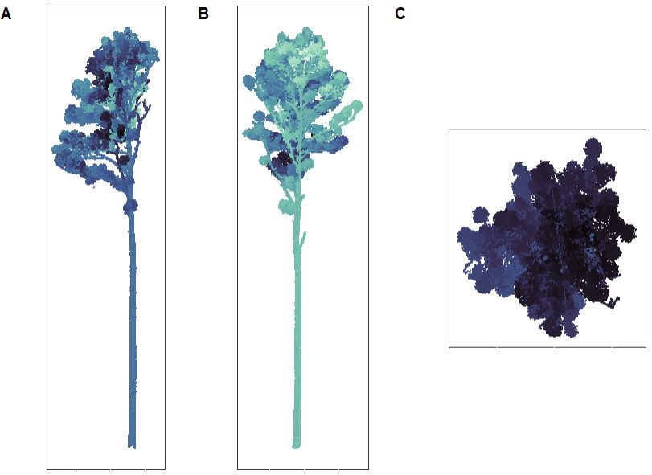
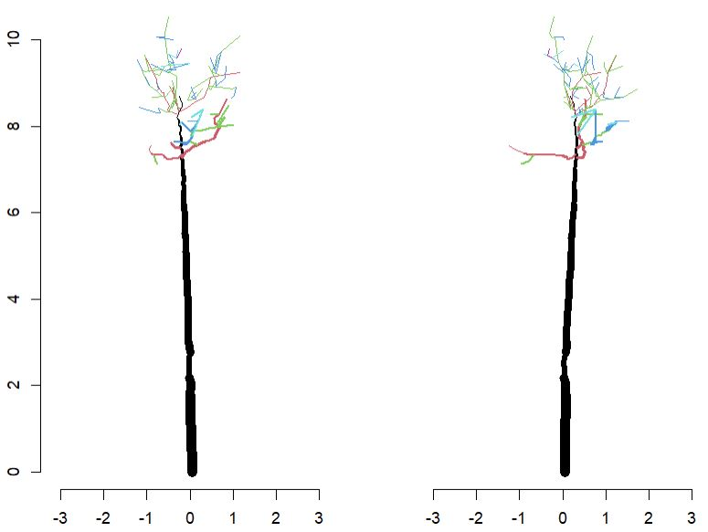
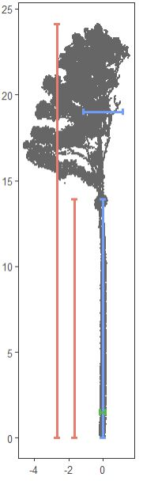

# 🌲📐tReeTraits 📐🌲

**An R Package to generate data on tree architecture from terrestrial lidar scans**

`tReeTraits` helps quantify tree architecture, especially traits relevant to windfirmness (e.g., crown area, volume, stem taper, branch size distribution), from individually segmented trees in terrestrial lidar datasets.

It combines functionality from multiple tools including [TreeQSM](https://github.com/InverseTampere/TreeQSM/), [lidR](https://r-lidar.github.io/lidRbook/), and [ITSMe](https://github.com/lmterryn/ITSMe), and follows methods described in Cannon et al. (in prep).

------------------------------------------------------------------------

## ✨ Features

-   **Preprocessing**: Recenter, normalize, rotate trees, and clean surrounding vegetation.
-   **Point Cloud Metrics**: Crown width, height, volume, DBH, crown base height, lever arm, lacunarity, etc.
-   **QSM Integration**: Run [TreeQSM](https://github.com/InverseTampere/TreeQSM/) from R via MATLAB to compute stem and branching traits.
-   **QSM Metrics**: Center of mass, trunk taper, branch diameter distributions, branching patterns -**Visualization**: Built-in diagnostic plots for inspection and reporting.

## 📦 Installation

This package depends on CRAN and GitHub packages:

```{r}
install.packages("lidR")
install.packages("remotes")  # For GitHub installation

remotes::install_github("bi0m3trics/spanner")
remotes::install_github("Imterryn/ITSMe")
remotes::install_github("tiagodc/TreeLS")

# Install tReeTraits itself
remotes::install_github("jbcannon/tReeTraits")
```

## 🔧 Requirements (for QSM features)

If you plan to generate Quantitative Structure Models (QSMs), you'll need:

### MATLAB Requirements

-   A licensed installation of <a href=https://www.mathworks.com/help/install/ug/install-products-with-internet-connection.html> **MATLAB**</a>
-   Toolboxes
    -   `<a href=https://www.mathworks.com/matlabcentral/answers/4707-how-can-i-download-parallel-computing-toolbox`{=html}Parallel Computing Toolbox</a>
    -   `<a href=https://www.mathworks.com/products/statistics.html`{=html}Statistics and Machine Learning Toolbox</a>

### TreeQSM Requirements

-   Download the <a href=https://github.com/InverseTampere/TreeQSM>TreeQSM<a> codebase from Github

## 🚀 Getting Started

### Pre-processing an Example tree

```{r}
library(tReeTraits)
library(lidR)

las <- readLAS(system.file("extdata", "tree_0723.las", package = "tReeTraits"))

# Clean and preprocess: recenter, normalize, remove understory vegetation
las_clean <- clean_las(las, bole_height = 2)

# Plot tree from 3 angles
plot_tree(las_clean)
```


Pine tree with vegetation around bole removed.

### Basic Trait Calcuation

```{r}
height <- get_height(las_clean)
width  <- get_width(las_clean)[1]
dbh    <- get_dbh(las_clean, select_n = 30)
cbh    <- get_crown_base(las_clean, threshold = 0.25, sustain = 2)
```

### Crown structure and Volume

```{r}
las_crown <- segment_crown(las_clean, crown_base_height = cbh)

area_convex <- st_area(convex_hull_2D(las_crown))
area_voxel  <- st_area(voxel_hull_2D(las_crown))
lacunarity  <- get_lacunarity(las_crown)

volume_alpha <- get_crown_volume_alpha(las_crown)
volume_voxel <- get_crown_volume_voxel(las_crown)

```



Illustration of convex hull (dashed line) and voxel hull (green feature) from tree_0129. The proportion of whitespace within the convex hull represents lacunarity (\~20%)

### 🌲 Generate a Quantitative Structure Model (QSM)

The `tReeTraits` package includes tools to prepare and run <a href=https://github.com/InverseTampere/TreeQSM>TreeQSM</a> from within R using segmented tree point clouds. The following example shows how to create a QSM using a cleaned `.las` file, generate a `.mat` file for MATLAB, and run TreeQSM.

#### Steps

-   Load and clean a single-tree LAS file
-   Convert the LAS file to .mat format
-   Set TreeQSM input parameters
-   Run TreeQSM from R
-   Load the resulting QSM

```{r}
library(lidR)
library(tReeTraits)

# Step 1: Load and clean the LAS file
las = readLAS(system.file("extdata", "tree_0744.laz", package="tReeTraits"))
las = filter_poi(las, Intensity > 44000)  # Remove foliage
las = clean_las(las)

# Step 2: Convert to .mat format for TreeQSM
tree_mat = las_to_mat(las)

# Step 3: Get or modify default TreeQSM parameters
params = default_qsm_inputs()
print(params) #view and change params if you wish
params$PatchDiam2Max = c(0.05, 0.06, 0.07)  # Optional customization

# Step 4: Run TreeQSM from R
# TreeQSM directory should point to the directory where TreeQSM is downloaded.
qsm_file = run_qsm(
  tree_mat = tree_mat,
  unique_id = "Tree_0744",
  output_results = "R:/landscape_ecology/projects/canopy-traits/qsm-results/",
  TreeQSM_directory = "R:/landscape_ecology/projects/canopy-traits/docs/TreeQSM/",
  parameter_inputs = params
)

# Step 5: Load the resulting QSM
qsm = load_qsm(qsm_file)
head(qsm)
plot_qsm(qsm)
```

#### Requirements

-   MATLAB must be installed and callable from the system command line.
-   The TreeQSM codebase must be present and accessible via TreeQSM_directory.
-   Requires a .las file representing a single segmented tree with minimal foliage.

### 📐 Tree Geometry traits from QSM

These functions analyze tree geometry and volume from Quantitative Structure Models (QSMs), enabling detailed trait extraction and modeling.

`branch_volume_weighted_stats(qsm, breaks=NULL, FUN = mean)` Calculates volume-weighted branch diameter statistics using outputs from `branch_size_distribution()`.

`get_primary_branches(qsm)` Extracts primary branches (branching order = 1 attached to trunk) from the QSM.

`qsm_volume_distribution(qsm, terminus_diam_cm=4, segment_size=0.5)` Estimates tree volume and vertical distribution by separating trunk, terminus (top trunk \< terminus_diam_cm), and primary branches. Returns diameters, heights, and volumes by section for further biomass or mass-volume modeling.

`fit_taper_Kozak(qsm, dbh, terminus_diam_cm=4, segment_size=0.25, plot=TRUE)` Fits Kozak’s taper equation to trunk segments, modeling diameter as a function of relative height:

$$ d(h)/D = a_0 +a_1(h/H)+a_2(h/H)^2+a_3(h/H)^3 $$

Outputs model coefficients, R², RMSE, and an optional plot.

`get_stem_sweep(qsm, terminus_diam_cm=4, plot=TRUE)` Computes tree sweep by measuring deviations of trunk points from a straight idealized line between the top and bottom QSM trunk segments. Returns sweep distances by height for quantifying stem curvature. Optionally plots sweep vs. height.

`get_stem_tilt(qsm, terminus_diam_cm=4)` Calculates overall stem tilt as the angle between the straight line connecting the lowest and highest trunk points and the vertical axis. Outputs tilt angle in degrees, quantifying tree lean.

### 🩺 Diagnostic Plots

This section provides functions to generate diagnostic plots that help visualize tree point clouds, QSMs, and related metrics to identify potential errors or assess data quality.

#### Plot Tree Point Cloud

Creates a 3-panel plot showing two vertical profiles (X-Z and Y-Z) and an overhead (X-Y) view of the tree crown point cloud. Useful for spotting stray points or segmentation errors.

```{r}
plot_tree(las, res = 0.05, plot = TRUE)
```



Figure illustrating 3 views of tree_0129

#### Plot Quantitative Structure Model (QSM)

Displays a simple base R plot of the QSM colored by branching order, optionally showing two rotated views.

```{r}
qsm_file = system.file("extdata", "tree_0723_qsm.mat", package='tReeTraits')
qsm = load_qsm(qsm_file)
plot_qsm(qsm)
```



`plot_qsm()` output for tree-0723

### Basic Tree Measurements Diagnostic Plot

Visualizes basic tree measurements (height, crown base height, crown width, DBH) overlaid on a voxel-thinned point cloud.

```{r}
las_file = system.file("extdata", "tree_0129.laz", package="tReeTraits")
las = lidR::readLAS(las_file)
las = clean_las(las)
basics_diagnostic_plot(las, height=24.1, cbh=13.9, crown_width=2.29, dbh=0.329, res = 0.1)
```



`basics_diagnostic_plot()` output for tree-0129

#### See also

-   Crown Hull Diagnostic Plot `hull_diagnostic_plot(las, res = 0.1)`
-   Taper Diagnostic Plot \``taper_diagnostic_plot(qsm, dbh)`
-   Branch Diameter Distribution Plot `branch_distribution_plot(qsm)`
-   Full Diagnostic Plot `full_diagnostic_plot(las, qsm, height, cbh, crown_width, dbh, res = 0.1)`

------------------------------------------------------------------------

## 📖 Citation

The `treeTraits` package is associated with Cannon et al. (in press) XXXX. Please return at a later date for a full citation.
