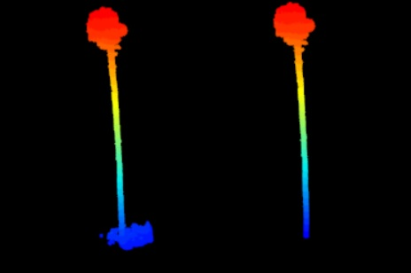

# tReeTraits

An R Package to generate data on tree architecture from terrestrial lidar scans

# Summary

`tReeTraits` is an `R` package designed to help extract traits on tree architecture
from terrestrial lidar data representing individually segmented trees, especially
traits related to windfirmness (e.g., crown area, volume, stem taper, branch size
distribution, etc). The package itself draws heavily from other available software
especially <a href='https://github.com/InverseTampere/TreeQSM/'>TreeQSM</a>, 
<a href=https://r-lidar.github.io/lidRbook/>lidR</a>,
and <a href=https://github.com/lmterryn/ITSMe>ITSMe</a>. The package brings
these elements together into one package following the methods of Cannon et
al. XXXX.

The package offers functions to (1) pre-process individually segmented trees, (2)
generate a QSM from R by calling a MATLAB program, and (3) calculate all traits
from point clouds and QSMs.

* **Preprocessing**: Functions to load, recenter, normalize and rotate trees, as 
well as remove vegetation from the vicinity of the bole.
* **QA/QC**: Function to plot all trees to identify mistakes in segmentation
* **Calculate tree traits from point cloud**: Calculate basic traits derived from
the point cloud including height, crown width, area, and volume.
* **Make Quantitative Structure Models**: Set parameters and run TreeQSM in Matlab
without leaving R. This allows calculating additional traits on branching
architecture
* **Calculate tree trats from QSMs**: With input from TreeQSM, calculate additional
traits related to trunk taper, tilt, biomass, and branching architecture.

# Workflow


## Package installation

This package has dependencies not on CRAN that must be installed
including `spanner`, `ITSMe`, and `TreeLS`

```{r}
install.packages('lidR')
install.packages('remotes') #allows installation of github packages
remotes::install_github('bi0m3trics/spanner')
remotes::install_github('Imterryn/ITSMe')
remotes::install_github('tiagodc/TreeLS')
```

Get the latest released version of `tReeTraits from github

```{r}
remotes::install_github('jbcannon/tReeTraits')
```

## Pre-processing

`tReeTraits` contains functions to load, recenter, normalize and rotate trees, 
as well as remove vegetation from the vicinity of the bole.

###  `clean_las()`

```{r}

library(tReeTraits)
library(lidR)

# load and view example data
las = lidR::readLAS(system.file("extdata", "tree_0723.las", package="tReeTraits"))
plot(las)

# clean_las will automatically recenter, normalize and remove vegetation
las = clean_las(las, bole_height=2)
plot(las)

```
</img>

Pine tree with vegetation around bole removed.

### `normalize_las()`

You can also normalize and recenter trees with individual functions to 
`normalize_las` and `recenter_las`

```{r}
las = lidR::readLAS(system.file("extdata", "tree_0723.las", package="tReeTraits"))
hist(las$Z)
las = normalize_las(las)
# view histogram of Z values now ranging from  0 to 11 m
hist(las$Z)
```
### `recenter_las()`

```{r}
las = readLAS(system.file("extdata", "tree_0744.laz", package="tReeTraits"))
# view histogram of original X/Y values
par(mfrow=c(1,2))
hist(las$X)
hist(las$Y)
las = recenter_las(las)
# view histogram of X/Y values centered on 0,0
par(mfrow=c(1,2))
hist(las$X)
hist(las$Y)
```

## Traits from point cloud

##  Traits From QSM

## Generating QSMs via Matlab:Treeqsm integration

### Set QSM/Matlab paths

### Generate parameters

### Run QSM

### Make QSM JPG


