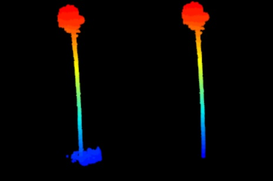
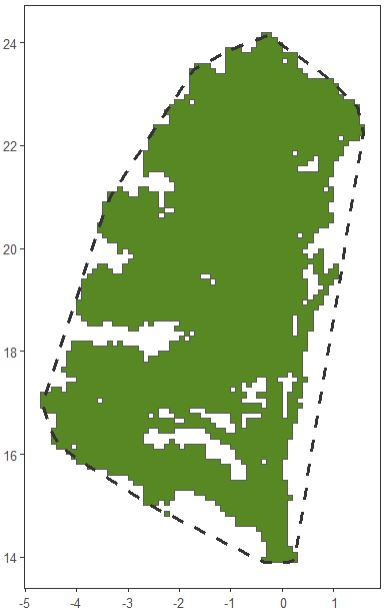
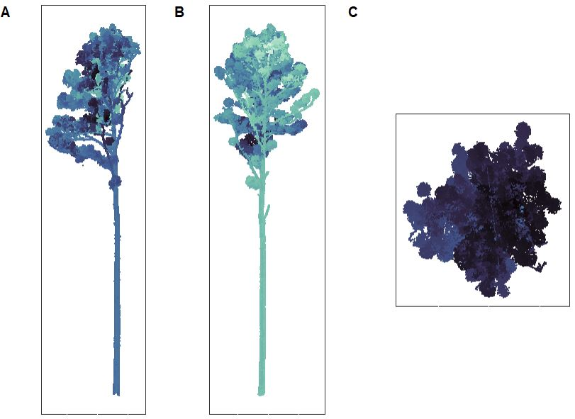
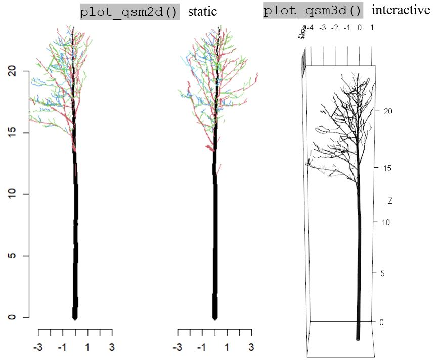
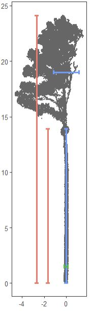

# 🌲📐tReeTraits 📐🌲

**An R Package to generate data on tree architecture from terrestrial lidar scans**

`tReeTraits` helps quantify tree architecture, especially traits relevant to windfirmness (e.g., crown area, volume, stem taper, branch size distribution), from individually segmented trees in terrestrial lidar datasets.

It combines functionality from multiple tools including [TreeQSM](https://github.com/InverseTampere/TreeQSM/), [lidR](https://r-lidar.github.io/lidRbook/), and [ITSMe](https://github.com/lmterryn/ITSMe), and follows methods described in Cannon et al. (in prep).

------------------------------------------------------------------------

## ✨ Features

-   **Preprocessing**: Recenter, normalize, rotate trees, and clean surrounding vegetation.
-   **Point Cloud Metrics**: Crown width, height, volume, DBH, crown base height, lever arm, lacunarity, etc.
-   **QSM Integration**: Run [TreeQSM](https://github.com/InverseTampere/TreeQSM/) from R via [PyTLiDAR](https://github.com/Landscape-CV/PyTLiDAR) to compute stem and branching traits.
-   **QSM Metrics**: Center of mass, trunk taper, branch diameter distributions, branching patterns
-   **Visualization**: Built-in diagnostic plots for inspection and reporting.

## 📦 Installation

This package depends on CRAN and GitHub packages:

```{r}
install.packages("lidR")
install.packages("remotes")  # For GitHub installation

remotes::install_github("bi0m3trics/spanner")
remotes::install_github("Imterryn/ITSMe")
remotes::install_github("tiagodc/TreeLS")

# Install tReeTraits itself
remotes::install_github("jbcannon/tReeTraits")
```

## 🔧 Requirements (for QSM features)

To generate Quantitative Structure Models (QSMs), you'll need a Python environment and the [`PyTLidar`](https://github.com/Landscape-CV/PyTLiDAR)\` library.

### 1. Install Conda

Install either Miniconda (recommended) or Anaconda:

-   📦 [Miniconda](https://www.anaconda.com/docs/getting-started/miniconda/install#quickstart-install-instructions) (recommended, lightweight)
-   🐍 [Anaconda](https://www.anaconda.com/download) (full distribution)

> 💡 Tip: Miniconda is smaller and faster to set up.

### 1. Install [`PyTLidar`](https://github.com/Landscape-CV/PyTLiDAR)

Once Conda is isntalled, you can install the Python dependency directly from within R using the helper function:

```{r}
install_PyTLidar()
```

## 🚀 Getting Started

### Pre-processing an Example tree

```{r}

library(tReeTraits)
library(lidR)

las <- readLAS(system.file("extdata", "tree_0723.las", package = "tReeTraits"))

# Clean and preprocess: recenter, normalize, remove understory vegetation
las_clean <- clean_las(las, bole_height = 2)

# Plot tree from 3 angles
plot_tree(las_clean)
```



Pine tree with vegetation around bole removed.

### Basic Trait Calcuation

```{r}
height <- get_height(las_clean)
width  <- get_width(las_clean)[1]
dbh    <- get_dbh(las_clean, select_n = 30)
cbh    <- get_crown_base(las_clean, threshold = 0.25, sustain = 2)
```

### Crown structure and Volume

```{r}
las_crown <- segment_crown(las_clean, crown_base_height = cbh)

area_convex <- st_area(convex_hull_2D(las_crown))
area_voxel  <- st_area(voxel_hull_2D(las_crown))
lacunarity  <- get_lacunarity(las_crown)

volume_alpha <- get_crown_volume_alpha(las_crown)
volume_voxel <- get_crown_volume_voxel(las_crown)

```



Illustration of convex hull (dashed line) and voxel hull (green feature) from tree_0129. The proportion of whitespace within the convex hull represents lacunarity (\~20%)

### 🌲 Example: Running TreeQSM from tReeTraits to generate a Quantitative Structure Model (QSM)

This example demonstrates how to:

1.  Load a single-tree LAS file
2.  Check for PyTLidar installation
3.  Configure TreeQSM input parameters
4.  Run TreeQSM directly from R
5.  Load and visualize the resulting QSM in 2D and 3D

```{r}
library(tReeTraits)

# Define input file and output directory
file <- system.file("extdata", "tree_0744.laz", package="tReeTraits")
tree_id <- tools::file_path_sans_ext(basename(file)) #extract tree id (or set it yourself)
output_dir <- "C:/Users/yourname/desktop/myTree/"

# ---- Step 1. Ensure PyTLidar is available ----
# This checks for a working Python environment with PyTLidar installed.
# If missing, it installs automatically via reticulate.
if (!check_PyTLidar_install()) {
  message("Installing PyTLidar environment ...")
  install_PyTLidar()
}

# ---- Step 2. Run TreeQSM ----
# The function runs the TreeQSM algorithm on a single-tree point cloud (.laz or .las).
# Adjust parameters for reconstruction resolution and patch size.
# You can set multiple parameters and treeQSM optimizes each combination
qsm_result <- run_treeqsm(
  file = file,
  intensity_threshold = 40000,   # Filter out low-intensity noise points
  resolution = 0.02,             # Voxel resolution; lower = finer detail but slower
  patch_diam1 = c(0.05, 0.1),    # Primary patch diameter
  patch_diam2min = c(0.04, 0.05), # Minimum secondary patch size
  patch_diam2max = c(0.12, 0.14), # Maximum secondary patch size
  verbose = TRUE                 # Print progress to console
)

# ---- Step 3. Save results ----
# This writes the QSM reconstruction, parameter table to disk.
write_qsm(
  qsm_result,
  name = tree_id,
  output_dir = output_dir
)

# ---- Step 4. Inspect model and outputs ----
# qsm_result is a list containing:
# - $qsm: data.frame of cylinder parameters
# - $qsm_pars: TreeQSM reconstruction parameters
# - $cloud: input point cloud (if retained)
print(qsm_result)

# ---- Step 5. Visualize QSM ----
# 2D projection for quick inspection
plot_qsm2d(qsm_result$qsm, scale = 50)

# Interactive 3D visualization (may take time)
plot_qsm3d(qsm_result$qsm)

```

#### Requirements

-   Requires a .las file representing a single segmented tree with minimal foliage.

### 📐 Tree Geometry traits from QSM

These functions analyze tree geometry and volume from Quantitative Structure Models (QSMs), enabling detailed trait extraction and modeling.

Using the example above, extract the qsm from `qsm_result`

```{r}
qsm = qsm_result$qsm
```

Then use the following functions for tree geometry traits

`branch_volume_weighted_stats(qsm_result$qsm, breaks=NULL, FUN = mean)` Calculates volume-weighted branch diameter statistics using outputs from `branch_size_distribution()`.

`get_primary_branches(qsm)` Extracts primary branches (branching order = 1 attached to trunk) from the QSM.

`qsm_volume_distribution(qsm, terminus_diam_cm=4, segment_size=0.5)` Estimates tree volume and vertical distribution by separating trunk, terminus (top trunk \< terminus_diam_cm), and primary branches. Returns diameters, heights, and volumes by section for further biomass or mass-volume modeling.

`fit_taper_Kozak(qsm, dbh, terminus_diam_cm=4, segment_size=0.25, plot=TRUE)` Fits Kozak’s taper equation to trunk segments, modeling diameter as a function of relative height:

$$ d(h)/D = a_0 +a_1(h/H)+a_2(h/H)^2+a_3(h/H)^3 $$

Outputs model coefficients, R², RMSE, and an optional plot.

`get_stem_sweep(qsm, terminus_diam_cm=4, plot=TRUE)` Computes tree sweep by measuring deviations of trunk points from a straight idealized line between the top and bottom QSM trunk segments. Returns sweep distances by height for quantifying stem curvature. Optionally plots sweep vs. height.

`get_stem_tilt(qsm, terminus_diam_cm=4)` Calculates overall stem tilt as the angle between the straight line connecting the lowest and highest trunk points and the vertical axis. Outputs tilt angle in degrees, quantifying tree lean.

### 🩺 Diagnostic Plots

This section provides functions to generate diagnostic plots that help visualize tree point clouds, QSMs, and related metrics to identify potential errors or assess data quality.

#### Plot Tree Point Cloud

Creates a 3-panel plot showing two vertical profiles (X-Z and Y-Z) and an overhead (X-Y) view of the tree crown point cloud. Useful for spotting stray points or segmentation errors.

```{r}
plot_tree(las, res = 0.05, plot = TRUE)
```



Figure illustrating 3 views of tree_0129

#### Plot Quantitative Structure Model (QSM)

Displays a simple base R plot of the QSM colored by branching order, optionally showing two rotated views.

```{r}
qsm_file = system.file("extdata", "tree_0723_qsm.mat", package='tReeTraits')
qsm = load_qsm(qsm_file)
plot_qsm(qsm)
```



`plot_qsm()` output for tree-0723

### Basic Tree Measurements Diagnostic Plot

Visualizes basic tree measurements (height, crown base height, crown width, DBH) overlaid on a voxel-thinned point cloud.

```{r}
las_file = system.file("extdata", "tree_0129.laz", package="tReeTraits")
las = lidR::readLAS(las_file)
las = clean_las(las)
basics_diagnostic_plot(las, height=24.1, cbh=13.9, crown_width=2.29, dbh=0.329, res = 0.1)
```



`basics_diagnostic_plot()` output for tree-0129

#### See also

-   Crown Hull Diagnostic Plot `hull_diagnostic_plot(las, res = 0.1)`
-   Taper Diagnostic Plot \``taper_diagnostic_plot(qsm, dbh)`
-   Branch Diameter Distribution Plot `branch_distribution_plot(qsm)`
-   Full Diagnostic Plot `full_diagnostic_plot(las, qsm, height, cbh, crown_width, dbh, res = 0.1)`

------------------------------------------------------------------------

## 📖 Citation

The `treeTraits` package is associated with Cannon et al. (in press) XXXX. Please return at a later date for a full citation.
